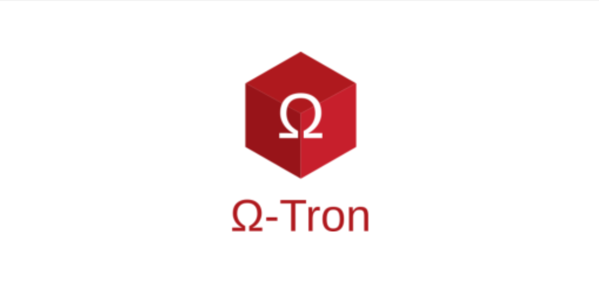
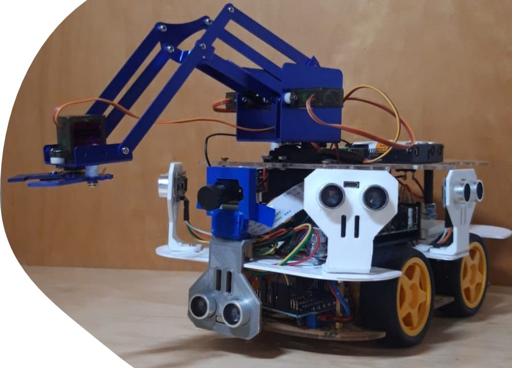
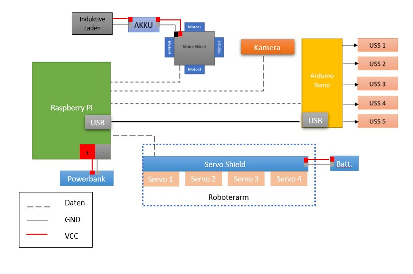
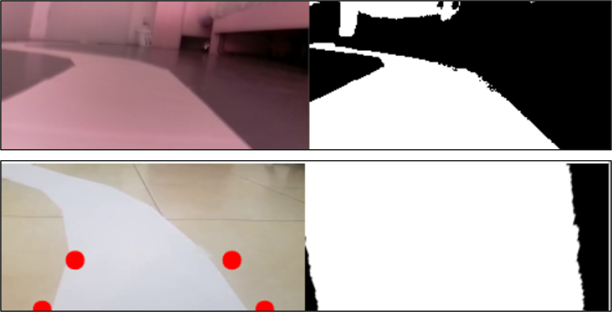
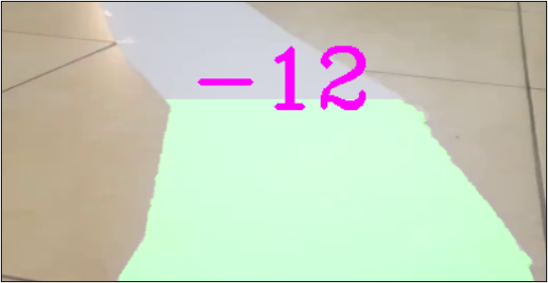
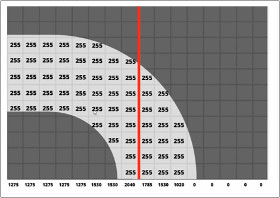
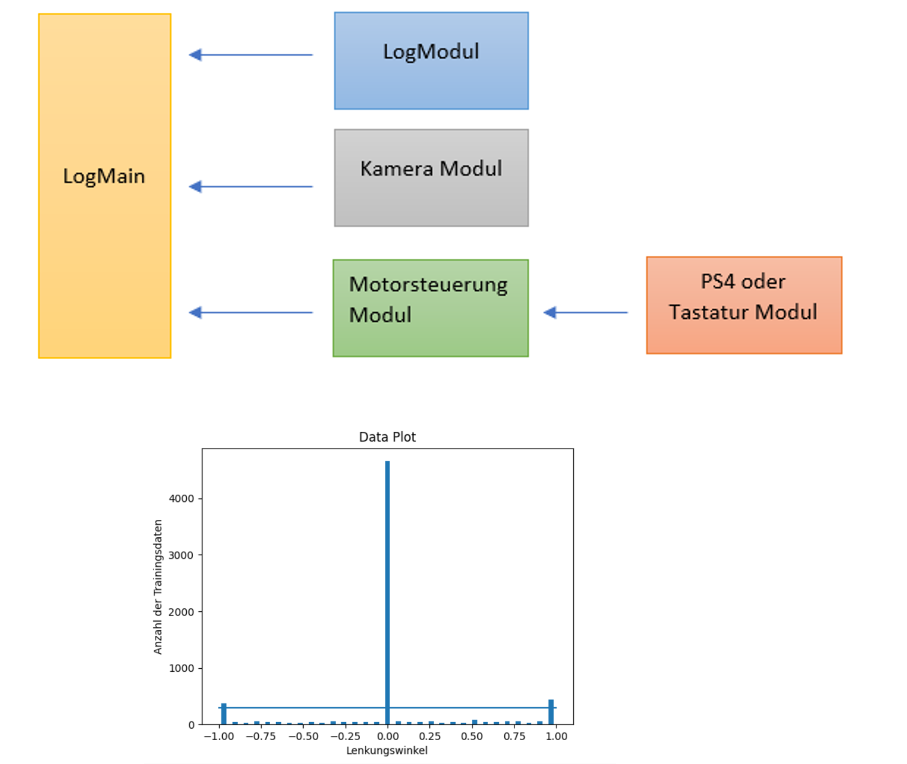
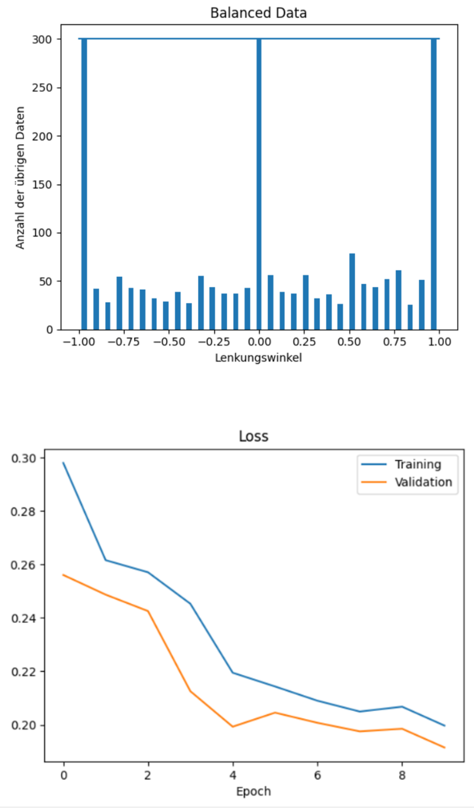
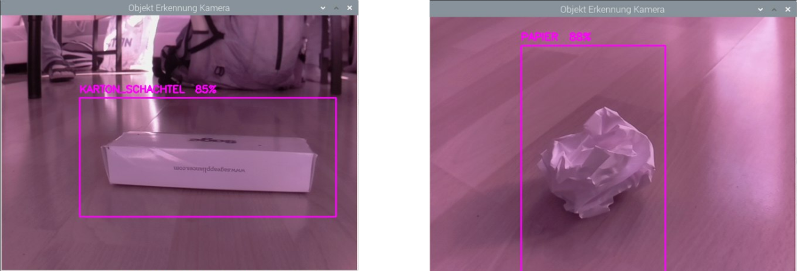
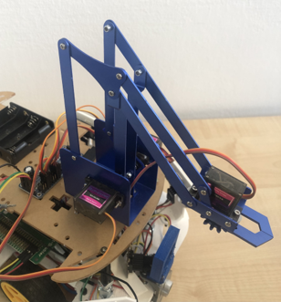

# Omega‑Tron – Autonomous Robot Vehicle  


Omega‑Tron is an autonomous robot vehicle developed as part of the M4000 project at Munich University of Applied Sciences.  
The system integrates **lane detection**, **obstacle avoidance**, **object detection**, **robot‑arm control**, **navigation**, and **inductive charging** into one modular platform powered by a Raspberry Pi 4B and Arduino Nano.

 

---

> **Note on images/videos below:** several media links in this README will not render on GitHub in their current form.

---

## Table of Contents
- [Project Overview](#project-overview)
- [System Architecture](#system-architecture)
- [Hardware Requirements](#hardware-requirements)
- [Software Requirements](#software-requirements)
- [Setup & Installation](#setup--installation)
- [YOLOv3 Training (Object Detection)](#yolov3-training-object-detection)
- [Running the System](#running-the-system)
- [Modules](#modules)


---


## Project Overview  
Omega‑Tron demonstrates how modern autonomous‑driving concepts can be implemented in a compact robotic system.  
The robot can:

- Detect and follow lanes  
- Avoid obstacles using 5 ultrasonic sensors  
- Identify objects (4 types of waste) using YOLOv3  
- Pick up objects with a 4‑DOF robot arm  
- Navigate using ROS odometry  
- Automatically dock to a charging station using a QR‑code marker
  

---

## System Architecture  
The project is divided into several functional modules:

- **Lane Detection**  
- **Obstacle Avoidance**  
- **Object Detection**  
- **Robot Arm Control**  
- **Navigation & ROS**  
- **Inductive Charging**  

---

## Hardware Requirements  
### Core components (bill of materials)
| Component | Spec / Notes | Qty |
|---|---|---|
| Raspberry Pi 4B | 4 GB or 8 GB RAM recommended (YOLOv3 + OpenCV are memory-hungry) | 1 |
| microSD card | 32 GB+, A1/A2 rated for acceptable I/O speed | 1 |
| Arduino Nano | ATmega328P, USB-to-serial (CH340 or FTDI) | 1 |
| HC‑SR04 ultrasonic sensor | 2 cm–400 cm range | 5 |
| JOY‑IT DC gear motors | 6 V–12 V, with wheels | 4 |
| Arduino Motor Shield L293D | dual H-bridge, up to 4 DC motors | 1 |
| PCA9685 servo driver | 16-channel, I2C, 6 V servo rail | 1 |
| MG996R / MG905 servos | robot arm joints (base/shoulder/elbow/gripper) | 4 |
| Raspberry Pi Camera Module | v2 (8 MP) or HQ Camera, ribbon cable long enough to mount | 1 |
| Inductive charging coil set (Tx + Rx) | matched pair, 5 V/12 V output depending on design | 1 |
| QR-code marker (printed) | matte paper/laminated, fixed size, mounted at charging dock | 1 |
| Chassis / mounting plates | laser-cut or 3D-printed, drawings in `docs/` | 1 set |
| Battery pack (drive/logic) | separate rails recommended: ~7.4–11.1 V LiPo for motors, 5 V/3 A UBEC for Pi | 1–2 |
| Voltage regulator / UBEC | steps battery voltage down to a clean 5 V for the Pi | 1 |
| Jumper wires, perfboard, JST connectors | for all sensor/motor/servo wiring | as needed |
| USB cable (Pi ↔ Arduino Nano) | serial link for the 5 ultrasonic sensors | 1 |

### Special / non-obvious equipment
- **Soldering iron, solder, heat‑shrink tubing** – most connectors (motor shield, PCA9685, battery leads) are not solder‑free.
- **Multimeter** – required to verify the two power rails (motor vs. logic) before first power-on; a wiring mistake here can kill the Pi.
- **3D printer or laser cutter access** – only needed if you fabricate your own chassis instead of buying an off-the-shelf one; STL/DXF files should be placed in `docs/`.
- **A second computer with a GPU (or a Google Colab account)** – needed for YOLOv3 training, see below. Training on the Raspberry Pi itself is not practical.
- **USB keyboard/mouse + HDMI monitor, or SSH access over Wi‑Fi** – for initial Raspberry Pi OS setup if you don't use headless provisioning.

---

## Software Requirements

### Raspberry Pi (master)
- **OS**: Raspberry Pi OS (Bullseye or newer, 64‑bit recommended) — flashed with Raspberry Pi Imager.
- **Python**: 3.9+
- **Python packages** (see `requirements.txt` per module; consolidated list):
  - `opencv-python` (or `opencv-contrib-python` if you need extra modules)
  - `numpy`
  - `torch`, `torchvision` (CPU build is enough for inference on the Pi; training happens off-device, see below)
  - `pygame` (PS4 controller input during data collection)
  - `pyserial` (serial link to the Arduino Nano)
  - `pandas`, `matplotlib`, `scikit-learn` (lane-following CNN training/data logging)
  - `Adafruit-GPIO`, `RPi.GPIO` (motor shield + PCA9685)
- Interfaces to enable via `sudo raspi-config` before anything else works:
  - **Camera** (`Interface Options → Camera`, or `libcamera` stack on Bullseye+)
  - **I2C** (`Interface Options → I2C`) — required for the PCA9685 servo driver
  - **Serial port** (`Interface Options → Serial Port`) — enable the hardware serial, **disable** the serial login shell, or the Arduino link will fight with a getty process

### Arduino Nano (slave)
- **Arduino IDE** 1.8.x or 2.x, or `arduino-cli`
- Board package: **Arduino AVR Boards**
- No extra libraries needed beyond the built-in `Arduino.h` for the ultrasonic firmware (plain `pulseIn`-based ranging); if you swap in a library-based ultrasonic driver (e.g. `NewPing`), install it via Library Manager.

### Navigation (ROS)
- **ROS Noetic** (Ubuntu 20.04) is the natural fit for a Python-2/3-transition-era project like this; if you're starting fresh today, ROS 2 (Humble/Jazzy) is worth considering instead, but the odometry/mapping instructions in `navigation/` assume ROS 1 conventions (catkin workspace, `roslaunch`).
- ROS typically runs more reliably on a 64-bit Ubuntu Server image on the Pi (or a companion laptop acting as ROS master) than on Raspberry Pi OS; decide this before wiring your network setup.
- Packages: `ros-noetic-navigation`, `ros-noetic-robot-localization` (or equivalents) for odometry/mapping; a `catkin` workspace under `navigation/`.

### YOLO training (done off the robot)
- Python 3.9+ with `torch`, `torchvision` (GPU build) **or** a Google Colab notebook (free GPU, no local install needed)
- A labeling tool: **LabelImg** or **CVAT** or **Roboflow** (any of these can export YOLO-format annotations)
- `opencv-python`, `numpy`, `matplotlib` for dataset inspection/augmentation

---

## Setup & Installation

1. **Flash the Pi**
   Flash Raspberry Pi OS with Raspberry Pi Imager, boot, run `sudo raspi-config` and enable Camera, I2C, and Serial (hardware port on, login shell off) as listed above. Reboot.

2. **Clone the repository**
   ```bash
   git clone <this-repo-url> Omega-Tron
   cd Omega-Tron
   ```

3. **Python environment**
   ```bash
   python3 -m venv .venv
   source .venv/bin/activate
   pip install -r requirements.txt
   ```

4. **Wire the hardware**
   Follow the wiring diagram in `docs/` for: motor shield → DC motors, PCA9685 → servos, HC‑SR04 sensors → Arduino Nano, Arduino Nano → Pi (USB), camera → Pi camera port. Double‑check the two power rails with a multimeter before connecting the Pi.

5. **Flash the Arduino Nano**
   Open `obstacle_avoidance/uss_slave/uss_slave.ino` in the Arduino IDE, select **Board: Arduino Nano** and the correct **Port**, then upload. Confirm with the Serial Monitor (9600 baud) that five distance values are being printed in a loop.

6. **Calibrate the classical lane detector**
   Run the lane-detection script with its trackbar window enabled and adjust the bird's-eye-view region and HSV thresholds for your track/lighting before trusting the output.

7. **(Optional) Set up ROS for navigation/docking**
   Install ROS Noetic (or your chosen distro) on the Pi or companion computer, build the `navigation/` catkin workspace, and confirm odometry topics are publishing before attempting autonomous docking.

8. **Place trained YOLO weights**
   Copy your trained `.weights`/`.pt` and `.cfg`/class-name files into `object_detection/` (see training section below) — the repo does not ship pretrained weights.

---

## YOLOv3 Training (Object Detection)

The object detector is **not trained on the robot**. Typical workflow:

1. **Collect images** of the 4 target waste classes under conditions similar to the robot's camera (angle, lighting, background).
2. **Label** the images in YOLO format (one `.txt` per image with `class x_center y_center width height`, normalized) using LabelImg, CVAT, or Roboflow.
3. **Split** the dataset into train/val (and ideally a held-out test set).
4. **Train**:
   - Easiest path: open the provided training notebook in **Google Colab** (free GPU), mount your dataset from Google Drive, and run the training cells — no local GPU required.
   - Local path: install a CUDA-capable PyTorch build and run the training script on your own GPU machine.
5. **Export** the resulting weights and config/class files.
6. **Deploy**: copy the exported files into `object_detection/` on the Pi. Inference on the Pi runs on CPU (or via OpenCV's DNN module), so keep the input resolution modest (e.g. 320×320) to maintain a usable frame rate.

---

## Running the System

Exact entry points depend on what's committed under each module folder; as a general pattern:

```bash
# Obstacle avoidance only (bench test)
python3 obstacle_avoidance/uss_master.py

# Lane following only
python3 lane_detection/lane_main.py

# Full autonomous run (lane + obstacle + object pickup)
python3 main.py
```

Run each module standalone first to verify sensors/actuators individually before running the combined `main.py` — this saves a lot of debugging time when something is miswired.

---
## Modules

### Lane Detection  

**Classical approach** 



- Canny edge detection  
- Bird’s‑eye transformation  
- Histogram‑based lane center estimation  
- Hough transform for line detection  

📹 Demo video: [Media1](doc/vids_pics/Media1.mp4)

**Deep learning approach**

- Data collection during driving  
- CNN training on lane images  
- Output: steering angle prediction  

 




📹 Demo videos: [Media2](doc/vids_pics/Media2.mp4) · [Media3](doc/vids_pics/Media3.mp4)

---

### Obstacle Avoidance  

 

- 5 ultrasonic sensors controlled by Arduino Nano  
- Encoded distance values sent to Raspberry Pi  
- Python master interprets sensor data  
- Motor control decisions via AMSpi  


---

### Object Detection  

 

YOLOv3 identifies trash objects and provides bounding boxes.  
Detected coordinates are forwarded to the robot arm module.

---

### Robot Arm  

 


- 4 degrees of freedom  
- MG996R / MG905 servos  
- PCA9685 for precise PWM control  
- Automated grasping based on object position  

📹 Demo video: [Media4](doc/vids_pics/Media4.mp4)

---

### Inductive Charging  
- Battery monitoring via GPIO  
- ROS navigation to charging station  
- Final alignment using QR‑code detection  

---

## 👥 Authors  
- Arlind Çurumi       - Team and SW Lead
- Christoph Häußler   - HW Integration Lead
- Jiang Qi Qiu  
- Ismail Güney  
- Munich University of Applied Sciences – Faculty of Mechanical Engineering - Mechatronics Laboratory
